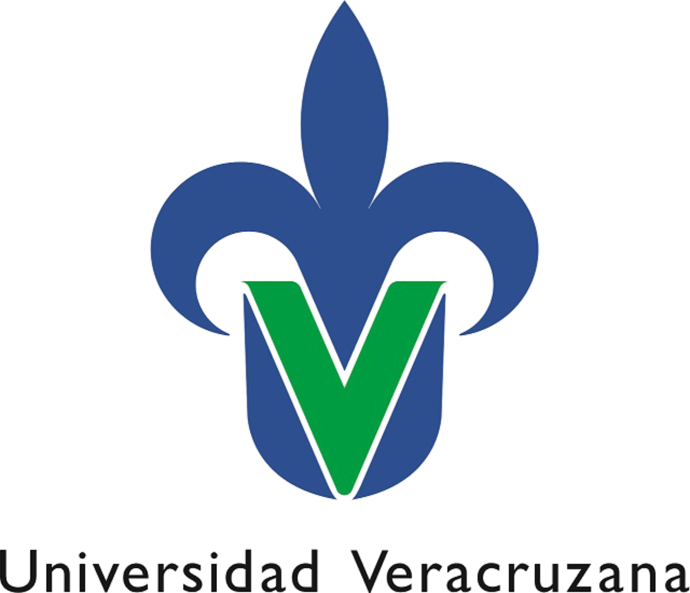
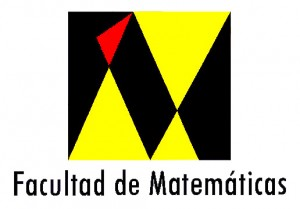

#Universidad Veracruzana.

# Programate nivel 1
## Brenda Medina

En este proyecto se presentan algunos métodos de ordenamiento, los cuales se describirán a continuación.
*Metodo de la burbuja 
*metodo de seleccion
*metodo de insersion 
*quicksort
